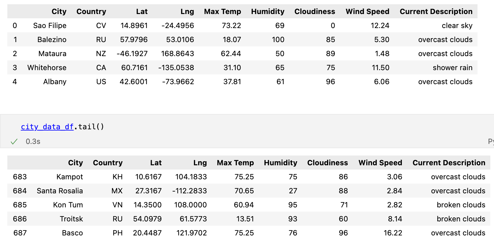
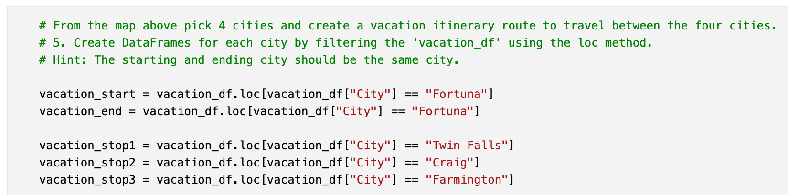

# World Weather Analysis

## Module 6 Challenge

The PlanMyTrip app will be updated with a few changes, to take the app to the next level. The weather description is being added in this module.

The user will enter the desired maximum and miniumum temperatures, which will be used to identify potential travel destinations and nearby hotels. From the list of potential travel destinations, four cities where selected to create a *travel itinerary*. Using the Google Maps Directions API, a travel route between the four cities as well as a marker layer map were created.

For this analysis, Python was used along with several APIs to produce customized maps with specific information.

## Deliverable 1

1.1 The following information has been retrieved from "OpenWeatherMap" site (2000 records analyzed):

* Latitude and longitude
* Maximum temperature
* Percent humidity
* Percent cloudiness
* Wind speed
* Weather description

1.2 The data was added to a new DataFrame (citi_data.df).

1.3 The data is exported as WeatherPy_Database.csv into the Weather_Database folder.

## Deliverable 2

2.1 The minimum and maximum temperature preferences are entered by the user.

2.2 A new DataFrame is created based on the minimum and maximum temperatures, and empty rows are dropped.

2.3 The hotel name is retrieved and added to the DataFrame, and the rows that don’t have a hotel name are dropped.

2.4 The DataFrame is exported as a CSV file into the Vacation_Search folder and is saved as WeatherPy_vacation.csv.

2.5 A marker layer map with pop-up markers for the cities in the vacation DataFrame is created, and it is uploaded as a PNG. Each marker has the following information:

* Hotel name
* City
* Country
* Current weather description with the maximum temperature

2.6 The marker layer map is saved and uploaded to the Vacation_Search folder as WeatherPy_vacation_map.png.

## Deliverable 3 Requirements

3.1 Four DataFrames created, one for each city on the itinerary.

3.2 The latitude and longitude pairs for each of the four cities retrieved.

3.3 A directions layer map between the cities and the travel map is created and uploaded as WeatherPy_travel_map.png.

3.4 A DataFrame that contains the four cities on the itinerary is created.

3.5 A marker layer map with a pop-up marker for the cities on the itinerary is created, and it is uploaded as WeatherPy_travel_map_markers.png. Each marker has the following information:

* Hotel name
* City
* Country
* Current weather description with the maximum temperature

